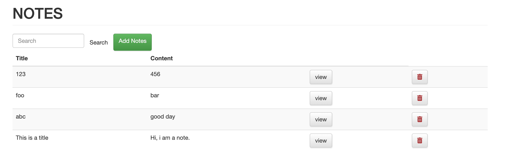
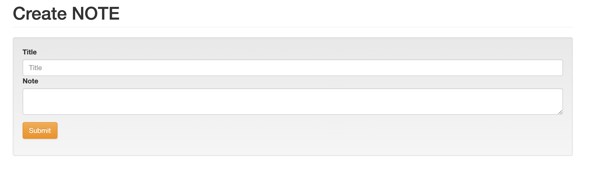
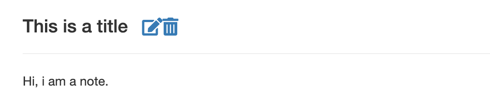
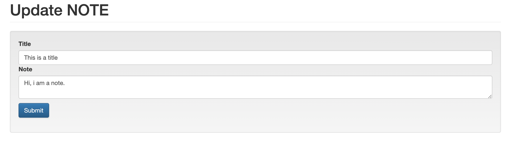

# Note app

## The mission

Used my own API to create the interface. It is a big step for me to because full stack developer.
In this project we need to choose js framework from Angular, React and VUE.js, which i choose VUE.js.
The reason is vue is more modern and light.
I only touch the surface of Vue.js, but i have to say i really like vue.js, after this project, i also learned React,because React still very popular in this industry.

## Features

1. Search note. You can type the title or some content in the title of your note, press search button and app will give you the list of notes which contain your search content.

   

1. Add note. Press the add note button, it will go to the add note page. Once you finished create notes, you can submit.
   There is a tiny home button to go home page.
1. Show the note. You can view the note details by click the view button.

   

1. Delete notes. You can delete note by click the detele button.Or you can view the note, there are two buttons, one for delete note, other for update the note.

   

1. update notes.

## What do i learn

1. install vue.js
1. fetch API
1. v-on
1. V-model
1. V-for
1. router-link
1. component
